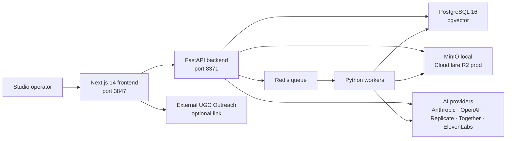

<p align="center">
  <strong>PUKOSTUDIO Content</strong>
</p>

<h1 align="center">ContentForge</h1>

<p align="center">
  A dark-studio AI content production workspace for assets, tags, scripts, image generation, video pipelines, and finished creative operations.
</p>

<p align="center">
  
  
  
  
  
</p>

<p align="center">
  <a href="#quick-start">Quick Start</a>
  ·
  <a href="#workspace-map">Workspace Map</a>
  ·
  <a href="#architecture">Architecture</a>
  ·
  <a href="#environment">Environment</a>
  ·
  <a href="#deployment">Deployment</a>
</p>

---

## Overview

ContentForge is a personal AI content studio built for the full creative production loop:

- import and organize visual assets
- design flexible multi-level tag systems
- generate scripts, images, and video projects with AI providers
- run async production workers for imports, thumbnails, tagging, embeddings, and rendering
- manage brands, SKUs, projects, collections, templates, productions, and operating metrics
- keep UGC outreach as an external product while retaining a configurable entry point

The product keeps a dark, motion-led studio language: dense but readable, built for repeated operational use instead of a landing-page demo.

## Product Principles

| Principle | Meaning |
| --- | --- |
| Work first | The first screen should be the actual production workspace, not marketing copy. |
| Main canvas first | Large, high-value work happens in the center. Side panels hold context and actions. |
| No dead spinners | AI enrichment must be optional. Uploads and covers stay usable without provider keys. |
| Human tagging | Tags are selectable, editable, multi-level, and visible enough for real asset operations. |
| Relative APIs | Browser calls use relative `/api` paths by default so local, Docker, and production stay consistent. |
| External UGC | `/blogger-manager` is only an entry point. UGC Outreach runs as a separate system. |

## Workspace Map

| Route | Area | Purpose |
| --- | --- | --- |
| `/dashboard` | Command center | Studio overview, KPIs, activity, system pulse. |
| `/upload` | Intake | Upload files or import online URLs into the asset library. |
| `/assets` | Asset library | Search, filter, preview, favorite, delete, and tag creative assets. |
| `/assets/[id]` | Asset detail | Preview media, edit metadata, and manage first/second/third-level tags. |
| `/tags` | Tag system | Maintain flexible taxonomy and seed tag families. |
| `/collections` | Collections | Group assets for campaigns, brands, products, or production batches. |
| `/ai/one-click` | One-click video | Create a full video pipeline from product brief to generated clips. |
| `/ai/script` | AI script | Generate content scripts and creative copy. |
| `/ai/image` | AI image | Generate images and save results back to the asset library. |
| `/ai/video` | AI video | Manage AI video projects and clip generation. |
| `/productions` | Finished videos | Review final outputs, metadata, downloads, and operational status. |
| `/projects` | Projects | Organize production work by project. |
| `/brands` | Brands | Manage brand entities and reusable brand context. |
| `/skus` | Products | Manage product/SKU data used by creative generation. |
| `/templates` | Templates | Save reusable production or prompt templates. |
| `/stats` | Analytics | Deeper operating metrics and content performance signals. |
| `/settings` | Settings | Provider keys, storage, system configuration, and diagnostics. |
| `/blogger-manager` | External UGC | Opens the configured UGC Outreach system via `NEXT_PUBLIC_UGC_URL`. |

## Architecture



## Tech Stack

| Layer | Stack |
| --- | --- |
| Frontend | Next.js 14, React 18, TypeScript, Tailwind CSS, shadcn-style primitives, Radix UI, TanStack Query, TanStack Virtual, Zustand |
| Backend | FastAPI, SQLAlchemy 2, Alembic, Pydantic v2, asyncpg, pgvector |
| Workers | Redis-backed async task workers for imports, AI tagging, embeddings, thumbnails, video generation, and rendering |
| Storage | MinIO for local development, Cloudflare R2/S3-compatible storage for production |
| AI | Anthropic, OpenAI, Replicate Seedance, Together, ElevenLabs, optional provider keys |
| Tooling | pnpm, uv, Docker Compose, Vitest, Pytest, Ruff, Black |

## Repository Layout

```text
contentforge/
├── backend/                 FastAPI app, Alembic migrations, workers, tests
│   ├── app/
│   │   ├── core/            config, auth, storage, cache, AI gateway
│   │   ├── modules/         assets, tags, brands, projects, videos, stats
│   │   └── workers/         task registry and worker handlers
│   ├── migrations/          Alembic migration history
│   └── tests/               backend test suite
├── frontend/                Next.js app router frontend
│   ├── app/                 product routes and pages
│   ├── components/          shared studio UI
│   ├── hooks/               reusable client hooks
│   └── lib/                 API clients and utilities
├── config/                  seed data, including tag families
├── deploy/                  nginx and production deployment notes
├── prompts/                 prompt templates
├── docker-compose.yml       local full-stack environment
├── docker-compose.prod.yml  production-oriented compose stack
└── .env.example             environment variable template
```

## Quick Start

### Prerequisites

- Node.js 20+
- pnpm 9+
- Python 3.11+
- uv
- Docker Desktop or Docker Engine

### 1. Clone and configure

```bash
git clone https://github.com/ZhewZhunglum/PUKOSTUDIO-content.git
cd PUKOSTUDIO-content

cp .env.example .env
```

Edit `.env` before the first real run:

```bash
SECRET_KEY=replace-with-a-long-random-secret
ADMIN_USERNAME=sam
ADMIN_PASSWORD=replace-with-a-strong-password
```

AI keys can stay empty during local setup. Importing, browsing, tagging manually, and using the core workspace will still work.

### 2. Start infrastructure

The compose file uses an external internal network for nginx/frontend routing, so create it once:

```bash
docker network create contentforge_internal 2>/dev/null || true
docker compose up -d postgres redis minio minio-init
```

### 3. Run database migrations

This step is required. It creates the `users` table and all business tables.

```bash
docker compose run --rm backend alembic upgrade head
```

### 4. Start the full studio

```bash
docker compose up --build
```

Open:

| Service | URL |
| --- | --- |
| Frontend | http://localhost:3847 |
| API docs | http://localhost:8371/docs |
| Health check | http://localhost:8371/healthz |
| MinIO console | http://localhost:9001 |
| Nginx entry | http://localhost |

Default local MinIO credentials:

```text
username: minioadmin
password: minioadmin
```

## Local Development

### Install dependencies

```bash
pnpm install
uv sync
```

### Run backend locally

Start dependencies first:

```bash
docker network create contentforge_internal 2>/dev/null || true
docker compose up -d postgres redis minio minio-init
```

Then run migrations and the API:

```bash
cd backend
uv run alembic upgrade head
uv run uvicorn app.main:app --host 0.0.0.0 --port 8371 --reload
```

### Run workers locally

```bash
cd backend
uv run python -m app.workers.main
```

### Run frontend locally

From the repository root:

```bash
pnpm dev
```

The frontend runs on `http://localhost:3847`.

## Common Commands

| Command | Description |
| --- | --- |
| `pnpm dev` | Start the Next.js frontend. |
| `pnpm build` | Build the frontend for production. |
| `pnpm lint` | Run Next.js linting. |
| `pnpm test` | Run frontend tests with Vitest. |
| `cd backend && uv run pytest -q` | Run backend tests. |
| `cd backend && uv run alembic upgrade head` | Apply database migrations. |
| `docker compose up --build` | Run the full local stack. |
| `docker compose down` | Stop containers while keeping volumes. |
| `docker compose down -v` | Stop containers and remove local data volumes. |

## Environment

Copy `.env.example` to `.env`. Never commit `.env`.

### Core

| Variable | Required | Description |
| --- | --- | --- |
| `DATABASE_URL` | Yes | SQLAlchemy async PostgreSQL URL. |
| `REDIS_URL` | Yes | Redis URL used by background workers and queue state. |
| `SECRET_KEY` | Yes | JWT/application secret. Use a long random value in production. |
| `ADMIN_USERNAME` | Recommended | Bootstrap admin username. Created or updated on backend startup. |
| `ADMIN_PASSWORD` | Recommended | Bootstrap admin password. Required with `ADMIN_USERNAME`. |
| `ENVIRONMENT` | Yes | `development`, `staging`, or `production`. |
| `LOG_LEVEL` | Yes | `DEBUG`, `INFO`, `WARNING`, or `ERROR`. |

### Storage

| Variable | Required | Description |
| --- | --- | --- |
| `S3_ENDPOINT` | Yes | Internal S3-compatible endpoint. Local default is MinIO. |
| `S3_ACCESS_KEY` | Yes | S3 or MinIO access key. |
| `S3_SECRET_KEY` | Yes | S3 or MinIO secret key. |
| `S3_BUCKET` | Yes | Bucket for assets, thumbnails, generated media, and renders. |
| `S3_PUBLIC_DOMAIN` | Yes | Browser-accessible public file domain or MinIO public bucket URL. |
| `S3_PRESIGNED_ENDPOINT` | Local Docker | Browser-accessible endpoint used for presigned upload/download URLs. |
| `NEXT_PUBLIC_STORAGE_DOMAIN` | Optional | Domain allowlist for Next.js image optimization, without protocol. |

### AI Providers

| Variable | Required | Description |
| --- | --- | --- |
| `ANTHROPIC_API_KEY` | Optional | Claude text and vision capabilities. |
| `OPENAI_API_KEY` | Optional | Image, TTS, ASR, and embedding capabilities. |
| `GOOGLE_API_KEY` | Optional | Optional provider integrations. |
| `REPLICATE_API_TOKEN` | Optional | Seedance video generation through Replicate. |
| `ELEVENLABS_API_KEY` | Optional | Voice generation. |
| `TOGETHER_API_KEY` | Optional | Optional model routing. |

### Frontend and integrations

| Variable | Required | Description |
| --- | --- | --- |
| `NEXT_PUBLIC_UGC_URL` | Optional | External UGC Outreach system URL. If empty, `/blogger-manager` shows a setup state. |
| `NEXT_PUBLIC_API_URL` | Optional | Explicit API origin. Usually leave empty for relative `/api` calls. |
| `INTERNAL_API_URL` | Docker frontend | Internal backend URL used by Next.js rewrites inside Docker. |

## Backend API Surface

Public:

- `GET /`
- `GET /healthz`
- auth/login routes

JWT-protected business modules:

- `/api/assets/*`
- `/api/assets/search`
- `/api/assets/facets`
- `/api/tags/*`
- `/api/collections/*`
- `/api/brands/*`
- `/api/skus/*`
- `/api/projects/*`
- `/api/video/*`
- `/api/productions/*`
- `/api/stats/*`
- `/api/templates/*`
- `/api/pipeline/*`
- `/api/settings/*`

UGC note:

- ContentForge does not mount `/api/ugc/*` as a business entry point.
- Historical UGC models and migrations remain in the backend for data safety.
- Use `NEXT_PUBLIC_UGC_URL` to link to the standalone UGC Outreach app.

## Data and Workers

ContentForge uses background workers for long-running or expensive work:

| Worker handler | Responsibility |
| --- | --- |
| `import_url` | Download and ingest online media. |
| `thumbnail` | Generate thumbnails and cover images. |
| `ai_tag` | Apply AI labels when provider keys are configured. |
| `embed` | Generate embeddings for visual/text search. |
| `video_gen` | Dispatch AI video generation jobs. |
| `render` | Compose final outputs and upload results. |
| `pipeline` | Run one-click video production pipelines. |

Run workers with:

```bash
cd backend
uv run python -m app.workers.main
```

## Deployment

Production notes live in [`deploy/README.md`](deploy/README.md).

High-level flow:

```bash
cp .env.prod.example .env.prod
# edit .env.prod with real secrets, database, storage, and public URLs

docker compose -f docker-compose.prod.yml build
docker compose -f docker-compose.prod.yml run --rm backend alembic upgrade head
docker compose -f docker-compose.prod.yml up -d
```

Production checklist:

- Use a strong `SECRET_KEY`.
- Set `ADMIN_USERNAME` and `ADMIN_PASSWORD` before first backend startup.
- Use a managed PostgreSQL or a backed-up Postgres volume.
- Use Cloudflare R2 or another durable S3-compatible bucket.
- Do not hard-code public IPs in frontend code.
- Keep `NEXT_PUBLIC_API_URL` and `ALLOWED_ORIGINS` aligned.
- Verify `/healthz`, login, asset upload, and video download after deployment.

## Quality Gates

Run these before pushing meaningful changes:

```bash
pnpm lint
pnpm test
pnpm build

cd backend
uv run pytest -q
```

Expected baseline:

- backend tests pass
- frontend lint/build pass
- key pages render without server errors:
  - `/dashboard`
  - `/assets`
  - `/upload`
  - `/productions`
  - `/ai/one-click`
  - `/ai/image`
  - `/ai/script`
  - `/ai/video`

## Troubleshooting

### `relation "users" does not exist`

Run migrations:

```bash
docker compose run --rm backend alembic upgrade head
```

or, in local backend mode:

```bash
cd backend
uv run alembic upgrade head
```

### Login does not create an admin user

Check `.env`:

```bash
ADMIN_USERNAME=sam
ADMIN_PASSWORD=your-password
```

Then restart the backend. The backend boot process creates or updates the configured admin user after migrations exist.

### Frontend cannot reach the API

Use relative API calls by leaving this empty in local browser mode:

```bash
NEXT_PUBLIC_API_URL=
```

In Docker, use:

```bash
INTERNAL_API_URL=http://backend:8371
```

### MinIO upload/download URLs fail in Docker

Keep the internal and browser-facing endpoints separate:

```bash
S3_ENDPOINT=http://minio:9000
S3_PRESIGNED_ENDPOINT=http://localhost:9000
```

### AI features spin or return provider errors

Core upload and asset management do not require AI keys. For AI features, set the relevant provider key and restart backend/workers.

## Git Workflow

```bash
git status
git add .
git commit -m "Describe the change"
git push
```

Remote:

```bash
origin https://github.com/ZhewZhunglum/PUKOSTUDIO-content.git
```

## Roadmap

- richer tag taxonomy management and bulk tagging
- deeper asset search facets and saved filters
- stronger production analytics and campaign reporting
- more robust video pipeline observability
- standalone UGC Outreach integration polish
- visual regression checks for critical studio pages

## Private Project Notice

This repository is a private PUKOSTUDIO production workspace. Do not commit secrets, provider keys, customer files, or production `.env` files.

